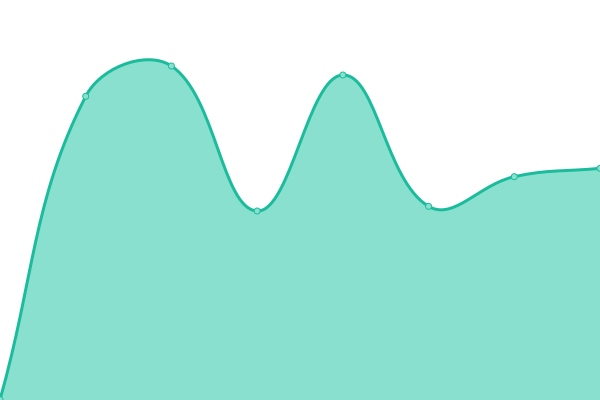

# [📈 Live Status](https://status.misskey.gg): <!--live status--> **🟩 All systems operational**

This repository contains the open-source uptime monitor and status page for [miss-key](https://status.misskey.gg), powered by [Upptime](https://github.com/upptime/upptime).

With [Upptime](https://upptime.js.org), you can get your own unlimited and free uptime monitor and status page, powered entirely by a GitHub repository. We use [Issues](https://github.com/miss-key/uptime/issues) as incident reports, [Actions](https://github.com/miss-key/uptime/actions) as uptime monitors, and [Pages](https://status.misskey.gg) for the status page.

<!--start: status pages-->
<!-- This summary is generated by Upptime (https://github.com/upptime/upptime) -->
<!-- Do not edit this manually, your changes will be overwritten -->
<!-- prettier-ignore -->
| URL | Status | History | Response Time | Uptime |
| --- | ------ | ------- | ------------- | ------ |
|  [Misskey.gg Main](https://misskey.gg) | 🟩 Up | [misskey-gg-main.yml](https://github.com/miss-key/uptime/commits/HEAD/history/misskey-gg-main.yml) | 

 974ms
     
 | 

<a href="https://status.misskey.gg/history/misskey-gg-main">100.00%</a>
    

|  [Misskey.gg S3](https://sss.misskey.gg/sss/) | 🟩 Up | [misskey-gg-s3.yml](https://github.com/miss-key/uptime/commits/HEAD/history/misskey-gg-s3.yml) | 

 360ms
     
 | 

<a href="https://status.misskey.gg/history/misskey-gg-s3">100.00%</a>
    

|  [Misskey.gg Media Proxy](https://p.misskey.gg/image.webp?url=https%3A%2F%2Fwww.google.com%2Fimages%2Fbranding%2Fgooglelogo%2F2x%2Fgooglelogo_light_color_272x92dp.png) | 🟩 Up | [misskey-gg-media-proxy.yml](https://github.com/miss-key/uptime/commits/HEAD/history/misskey-gg-media-proxy.yml) | 

 481ms
     
 | 

<a href="https://status.misskey.gg/history/misskey-gg-media-proxy">100.00%</a>
    

|  [Misskey.gg POST test](https://misskey.gg/api/get-online-users-count) | 🟩 Up | [misskey-gg-post-test.yml](https://github.com/miss-key/uptime/commits/HEAD/history/misskey-gg-post-test.yml) | 

 452ms
     
 | 

<a href="https://status.misskey.gg/history/misskey-gg-post-test">100.00%</a>
    

|  [Misskey.gg PING test](misskey.gg) | 🟩 Up | [misskey-gg-ping-test.yml](https://github.com/miss-key/uptime/commits/HEAD/history/misskey-gg-ping-test.yml) | 

 7ms
     
 | 

<a href="https://status.misskey.gg/history/misskey-gg-ping-test">100.00%</a>
    

|  [relay.misskey.gg](https://relay.misskey.gg/) | 🟩 Up | [relay-misskey-gg.yml](https://github.com/miss-key/uptime/commits/HEAD/history/relay-misskey-gg.yml) | 

 972ms
     
 | 

<a href="https://status.misskey.gg/history/relay-misskey-gg">99.15%</a>
    

<!--end: status pages-->

[**Visit our status website →**](https://status.misskey.gg)

## 📄 License

- Powered by: [Upptime](https://github.com/upptime/upptime)
- Code: [MIT](./LICENSE) © [miss-key](https://status.misskey.gg)
- Data in the `./history` directory: [Open Database License](https://opendatacommons.org/licenses/odbl/1-0/)
